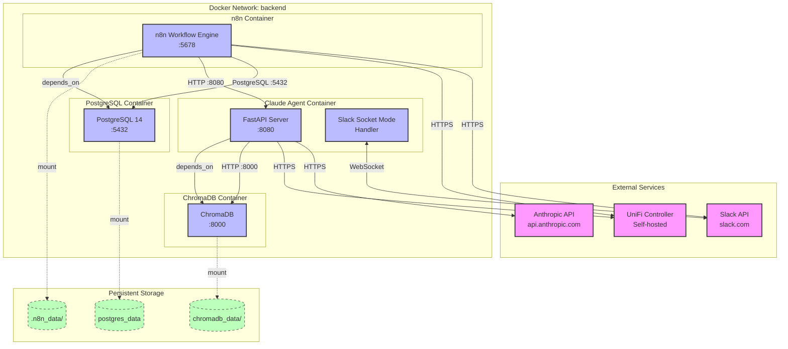
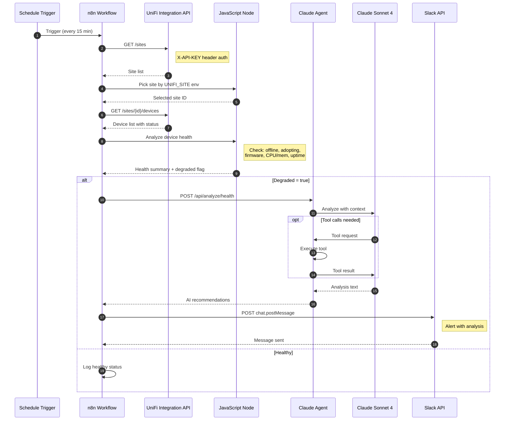
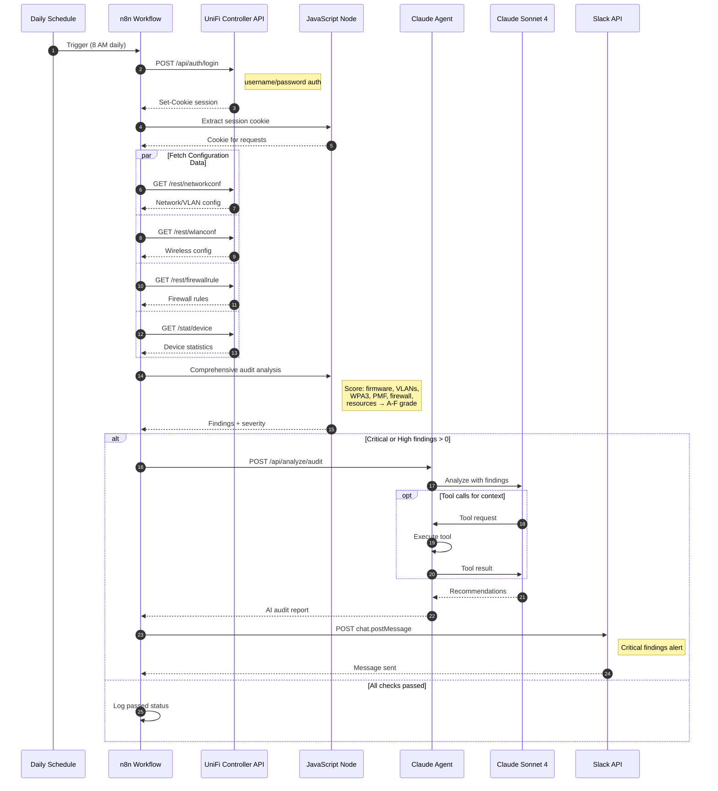
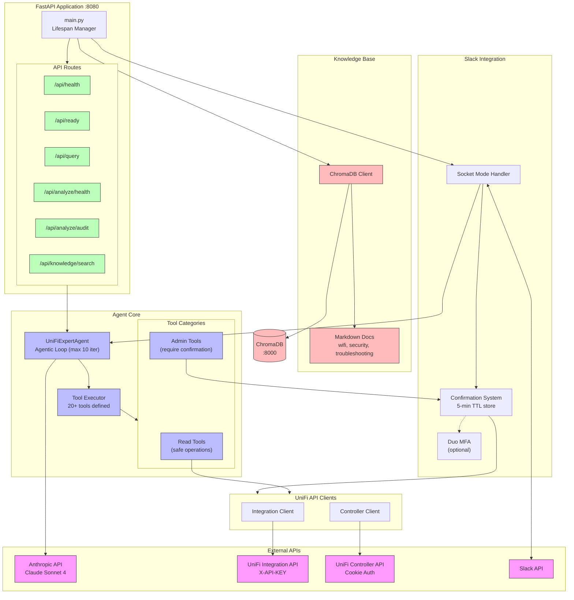
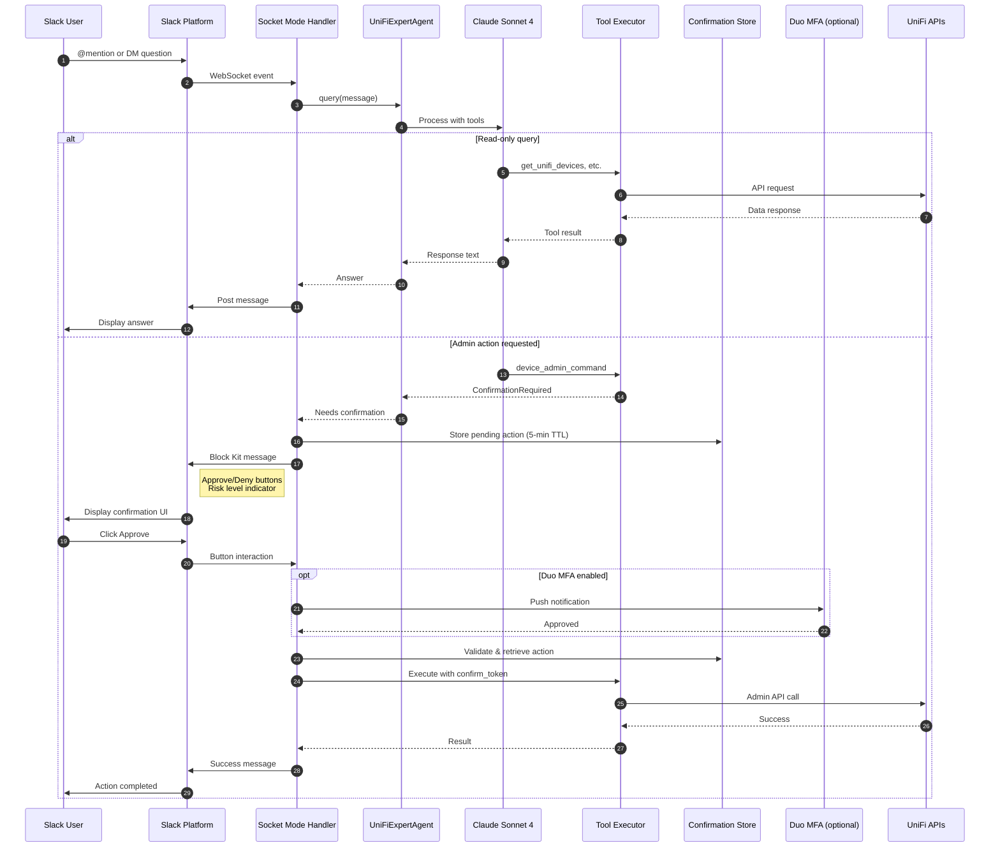
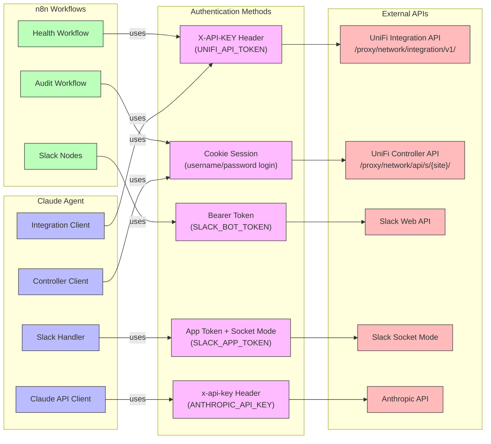

# Architecture Diagrams

Visual documentation of the n8n-codex stack architecture.

## Table of Contents

1. [Service Topology](#service-topology)
2. [Data Flow - Health Monitoring](#data-flow---health-monitoring)
3. [Data Flow - Security Audit](#data-flow---security-audit)
4. [Claude Agent Internal Architecture](#claude-agent-internal-architecture)
5. [Slack Interaction Flow](#slack-interaction-flow)
6. [Authentication Flows](#authentication-flows)

---

## Service Topology

Network topology showing all services, ports, and connections.

---

## Data Flow - Health Monitoring

Every 15 minutes: monitors device health and alerts on degradation.

---

## Data Flow - Security Audit

Daily at 8 AM: comprehensive security audit with AI recommendations.

---

## Claude Agent Internal Architecture

Component structure of the Claude Agent service.

---

## Slack Interaction Flow

User interaction via Slack with confirmation for admin actions.

---

## Authentication Flows

How different components authenticate with external services.

---

## Component Summary

| Component | Port | Purpose | Dependencies |
|-----------|------|---------|--------------|
| n8n | 5678 | Workflow automation | PostgreSQL |
| PostgreSQL | 5432 | n8n persistence | - |
| Claude Agent | 8080 | AI-powered UniFi expert | ChromaDB |
| ChromaDB | 8000 | Vector knowledge base | - |

## Data Persistence

| Volume | Mount Point | Contains |
|--------|-------------|----------|
| `postgres_data` | /var/lib/postgresql/data | n8n workflows, credentials |
| `.n8n_data/` | /home/node/.n8n | n8n config, logs |
| `chromadb_data/` | /chroma/chroma | Knowledge base vectors |

## Tool Categories

### Read Tools (No Confirmation)
- `get_unifi_sites`, `get_unifi_devices`, `get_device_details`
- `get_network_config`, `get_wlan_config`, `get_firewall_rules`
- `get_connected_clients`, `get_client_details`
- `get_traffic_stats`, `get_dpi_stats`, `get_top_clients`
- `get_recent_events`, `get_alarms`
- `search_knowledge_base`

### Admin Tools (Require Confirmation)
- `device_admin_command` - locate, restart, adopt, upgrade, forget
- `client_admin_command` - kick, block, unblock
- `create_guest_access` - temporary network access
- `update_wlan_settings` - SSID enable/disable, password changes
- `update_firewall_rule_settings` - rule enable/disable
